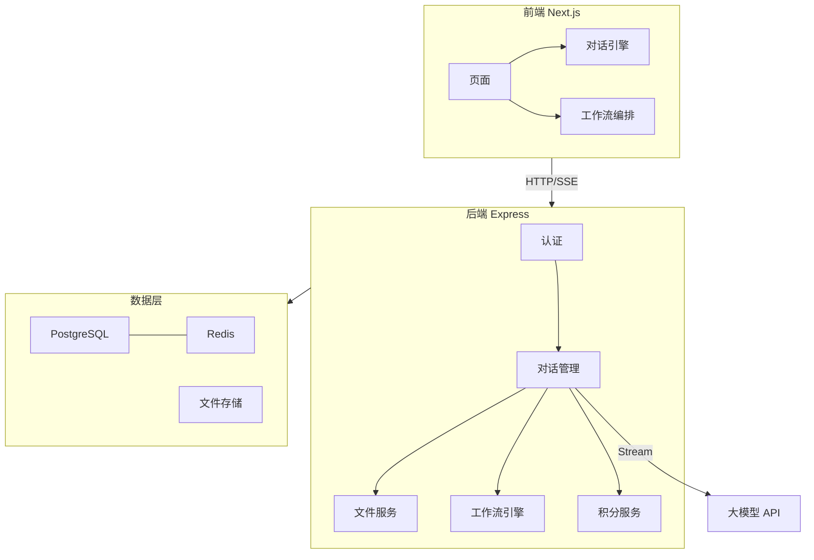

# 📋 PRD — 电商 AI 智能体聚合平台

> 最终产品需求文档 (Product Requirements Document)
> 版本: V1 MVP | 日期: 2026-02-26

---

## 一、核心目标 (Mission)

**为电商商家打造一站式 AI 智能助手平台**，通过 34 个深度定制的专业 AI 智能体，覆盖电商运营全链路（管理、营销、内容、财税、战略），帮助电商老板和团队用 AI 提效降本。

---

## 二、用户画像 (Persona)

| 维度 | 描述 |
|------|------|
| **目标用户** | 电商公司老板、运营团队、电商创业者 |
| **平台背景** | 天猫/淘宝/京东/拼多多/小红书/抖音卖家 |
| **核心痛点** | 缺专业顾问团队、决策慢、内容创作效率低、AI 工具分散 |

---

## 三、V1 MVP 功能清单

### 3.1 智能体矩阵 (34个，6大分类)

**📋 管理工具 (6)**

| # | 名称 | 核心能力 |
|---|------|---------|
| 1 | KPI教练 | 设计薪资结构和考核指标 |
| 2 | SOP梳理AI教练 | 梳理标准化操作流程 |
| 3 | OKR教练 | 战略目标拆解与策略训练 |
| 4 | 电商商业顾问 | 顶级商业大佬视角出谋划策 |
| 5 | 招聘教练 | 制定招聘方案和选人标准 |
| 6 | AI通用助手 | 通用对话，处理杂项任务 |

**🛒 电商工具 (8)**

| # | 名称 | 核心能力 |
|---|------|---------|
| 7 | 一键出10图提示词 | 从产品分析到出图提示词 |
| 8 | 天猫爆款趋势拆解 | 分析天猫市场新趋势 |
| 9 | 卖点教练 | 引导式挖掘产品超级卖点 |
| 10 | 天猫主图策划教练 | 围绕卖点完成主图策划 |
| 11 | 爆款裂变分析AI教练 | 爆款人群/场景裂变 |
| 12 | 天猫评价教练 | 生成高转化率评价 |
| 13 | 天猫竞争策略教练 | 竞品分析与竞争策略 |
| 14 | 天猫客单价提升教练 | 提升客单价方案 |

**📕 小红书 (8)**

| # | 名称 | 核心能力 |
|---|------|---------|
| 15 | 小红书爆文封面拆解 | 封面爆点元素拆解 |
| 16 | 小红书私域搭建SOP | 私域引流SOP |
| 17 | 小红书爆文拆解复制 | 复刻同行爆文 |
| 18 | 小红书爆款标题 | 高点击率标题生成 |
| 19 | 小红书起号话题 | 精准人群起号话题 |
| 20 | 小红书达人SOP流程 | 达人合作SOP |
| 21 | 小红书正文拆解SOP | 复刻爆款笔记正文 |
| 22 | 小红书笔记评论生成 | 高互动率评论 |

**👔 企业教练 (3)**

| # | 名称 | 核心能力 |
|---|------|---------|
| 23 | 毛泽东战略智能体 | 伟人视角战略决策 |
| 24 | 乔布斯产品教练 | 产品思维训练 |
| 25 | 张一鸣商业教练 | 字节视角商业决策 |

**📋 财税 (5)**

| # | 名称 | 核心能力 |
|---|------|---------|
| 26 | 降税模型测算 | 合规避税方案 |
| 27 | 股权架构设计 | 股权避险避税 |
| 28 | 电商平台专项合规 | 平台税务合规 |
| 29 | 薪酬与个税规划 | 最优发薪模型 |
| 30 | 预警诊断&稽查 | 税务风险排查 |

**🤖 AI陪跑教练 (4)**

| # | 名称 | 核心能力 |
|---|------|---------|
| 31 | AI工作流开发需求细化 | 细化AI落地需求 |
| 32 | 调研访谈—高价值场景 | 找赚钱模型和AI场景 |
| 33 | 火火提示词调试 | 调试优化提示词 |
| 34 | AI工作流访谈教练 | 找到业务流关键场景 |

### 3.2 多模态对话

| 输入方式 | 说明 |
|---------|------|
| ⌨️ 文字 | 标准文字聊天 |
| 🎤 语音 | 语音转文字 API |
| 📎 文件 | PDF / Word / PPT / 图片 上传解析 |

### 3.3 创新功能

| 功能 | 说明 |
|------|------|
| **🔗 Bot Chain 工作流** | 多个智能体串联自动执行，前者输出→后者输入 |
| **📄 一键导出报告** | 对话结果导出为 PDF/Markdown |
| **⭐ 对话收藏/历史** | 收藏、搜索、分类管理所有对话 |

### 3.4 用户系统 & 积分

- 手机号注册/登录，密码管理
- 积分充值（积分包 / 兑换码）
- 按次消耗积分，不同智能体可设不同价格
- 邀请好友双方奖励积分
- 积分明细账单

---

## 四、V2+ 版本规划

| 版本 | 功能 |
|------|------|
| V2 | 🎨 AI 作图工具 (Prompt生成电商图) |
| V2 | 👥 团队空间 (多人协作/权限管理) |
| V2 | 🤖 自定义智能体 |
| V2 | 📊 使用数据看板 |
| V3 | 📱 移动端 APP |
| V3 | 🔌 API 开放平台 |

---

## 五、关键业务规则

### 对话机制
1. 每个智能体内置"引导式对话"系统提示词——AI 主动提问，逐步挖掘需求，信息充足后输出结构化结果
2. 同一对话保持完整上下文，用户可追问
3. 对话历史滑动窗口避免 Token 溢出

### 🎭 智能体人设与提示词设计规范（重要）

每个智能体的系统提示词（System Prompt）必须遵循以下原则：

1. **角色人设一致性**：每个机器人必须有独特的人物设定，包括背景故事、专业领域、思维模式
2. **语气风格匹配**：不同角色的表达方式必须不同，严禁所有机器人用同一种"AI味"语气
   - 毛泽东战略智能体：宏观视野、军事化类比、辩证思维、语言有气势和感染力
   - 乔布斯产品教练：极致简约、追问本质、直球挑战用户、注重用户体验
   - 张一鸣商业教练：数据驱动、理性克制、字节系认知框架、注重效率和增长
   - 电商商业顾问：融合多位商业大佬思维模型（马云的愿景力、黄铮的性价比思维等）
3. **引导式对话结构**：所有提示词必须包含"先提问挖掘需求 → 逐步深入 → 最终输出结构化结果"的对话流程
4. **专业深度**：每个机器人在其专业领域要有足够的方法论深度，不能泛泛而谈
5. **输出规范**：每个机器人的最终输出必须有明确的结构化格式（如方案、报告、清单等）

### 文件处理
- 支持: PDF / Word (.docx) / PPT (.pptx) / 图片
- 上传后后端解析提取文本，注入对话上下文
- 单文件限制 20MB，单次最多 5 个文件
- 超长文本智能分块+摘要

### 工作流串联
- 每个节点输出做结构化摘要再传递
- 用户可在任意节点暂停、修改、继续
- 每个节点独立消耗积分
- 支持预设工作流 + 自定义串联

### 积分
- 余额不足时拒绝对话并提示充值
- 工作流中途积分耗尽，已完成节点结果保留
- 数据库事务保证扣减原子性

---

## 六、数据契约 (9张核心表)

```
Users:              id, phone, password_hash, nickname, avatar, points_balance, created_at
Conversations:      id, user_id, bot_id, title, is_favorited, status, created_at
Messages:           id, conversation_id, role, content, input_type, created_at
Attachments:        id, message_id, file_type, file_url, file_name, file_size, parsed_text
Bots:               id, name, slug, category, icon, description, system_prompt, points_per_use
Workflows:          id, name, description, bot_chain(JSON), is_preset, user_id
PointsTransactions: id, user_id, type, amount, balance_after, description, related_conversation_id
RedeemCodes:        id, code, points_amount, is_used, used_by, created_at
Invitations:        id, inviter_id, invitee_id, reward_points, created_at
```

---

## 七、UI 设计 — 方案 A「智慧门户」白色主题

### 设计系统

| Token | 值 | 用途 |
|-------|-----|------|
| 主背景 | `#FFFFFF` | 页面背景 |
| 次级背景 | `#F5F7FA` | 分区/卡片底 |
| 主色调 | `#2563EB` | 按钮/链接/强调 |
| 主文字 | `#1A1A2E` | 标题 |
| 次文字 | `#64748B` | 描述 |
| AI气泡 | `#F1F5F9` | AI消息 |
| 用户气泡 | `#2563EB` | 用户消息(白字) |
| 边框 | `#E2E8F0` | 卡片/输入框边框 |
| 卡片圆角 | `12px` | 所有卡片 |
| 按钮圆角 | `8px` | 所有按钮 |

### 页面设计稿 (6页)

#### 1. 首页 Dashboard


- 顶部导航: Logo + 搜索 + 积分 + 头像
- 欢迎区 + 推荐工作流卡片 (3张彩色渐变)
- 分类卡片网格 (6个分类，每类一行)
- 底部: 收藏/最近对话

#### 2. 对话界面


- 顶栏: 返回 + 智能体名 + 导出/收藏
- 聊天区: AI(左,灰蓝气泡) / 用户(右,蓝色气泡)
- 输入栏: 文本 + 📎上传 + 🎤语音 + 发送

#### 3. 工作流页面


- Tab: 预设工作流 / 自定义 / 运行历史
- 工作流节点链路可视化卡片

#### 4. 登录/注册


- 双栏: 左品牌展示 + 右登录表单

#### 5. 用户中心/积分


- 侧边栏导航 + 积分余额 + 充值包 + 明细表

#### 6. 对话历史


- 筛选 + 对话卡片列表 + 使用统计

### 交互规范

| 场景 | 时长 | 缓动 |
|------|------|------|
| hover反馈 | `100-150ms` | `ease-out` |
| 弹窗/下拉 | `200-300ms` | `cubic-bezier(0.16,1,0.3,1)` |
| 页面切换 | `300-500ms` | `cubic-bezier(0.65,0,0.35,1)` |
| 按钮点击 | `100ms` | `spring(400,17)` |
| 卡片hover | `200ms` | `translateY(-4px) + shadow` |

无障碍: 尊重 `prefers-reduced-motion` 设置

---

## 八、架构设计蓝图

> 详见 [architecture_blueprint.md](file:///C:/Users/78575/.gemini/antigravity/brain/6a84fbf1-6286-4c6a-a2ba-827244a4b085/architecture_blueprint.md)

### 系统架构



### 技术栈

| 层 | 选型 |
|----|------|
| 前端 | Next.js 14+ / TypeScript / CSS Modules / Zustand / Framer Motion |
| 后端 | Node.js 20+ / Express / TypeScript / Prisma |
| 数据库 | PostgreSQL 15+ / Redis |
| 文件 | 阿里云OSS |
| AI流式 | SSE |
| 部署 | Docker Compose |

### 核心风险

| 风险 | 等级 | 应对 |
|------|------|------|
| AI API 不稳定 | 🔴 | 重试+超时+备用模型 |
| Token 溢出 | 🔴 | 滑动窗口+分块摘要 |
| 工作流上下文膨胀 | 🟡 | 结构化摘要 |
| 文件解析 | 🟡 | 成熟库 |
| 积分并发 | 🟡 | 事务+行锁 |

### 项目目录

```
电商聚合机器人/
├── frontend/          # Next.js 前端
│   ├── app/           # 页面 (login, dashboard, chat, workflows, history, account)
│   ├── components/    # 共享组件 (NavBar, BotCard, ChatBubble, FileUploader...)
│   ├── services/      # API 服务
│   └── stores/        # Zustand 状态
├── backend/           # Express 后端
│   ├── src/
│   │   ├── routes/    # API 路由 (22个端点)
│   │   ├── services/  # Auth, Bot, Conversation, File, Workflow, Points, Export
│   │   ├── prompts/   # 34个智能体系统提示词
│   │   └── middleware/ # auth, error, rateLimit
│   └── prisma/        # schema.prisma (9张表)
├── docker-compose.yml
└── README.md
```

---

> 📌 **本文档为最终 PRD 存档，涵盖产品路线图、UI 设计稿、架构蓝图。**
> 确认后进入开发阶段。
